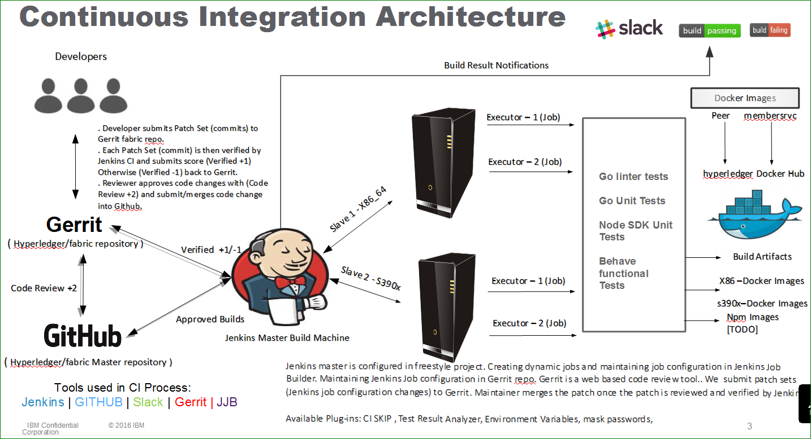

#Welcome to Gerrit Introduction:

Gerrit is a free, web-based collaborative code review tool that integrates with Git.

Create an Linux Foundation ID in below link
[Linux Foundation](https://identity.linuxfoundation.org/)
Once account is created - Login to [Gerrit](https://gerrit.hyperledger.org/r/#/admin/projects/lf-sandbox ) with your credentials

#####Setting up SSH keys:
Follow below steps to generate SSH keys:

 - From the Terminal or Git Bash, run ssh-keygen
 - Confirm the default path .ssh/id_rsa
 - Enter a passphrase (recommended) or leave it blank. Remember this passphrase, as you will need it to unlock the key whenever you use it.
 - Open ~/.ssh/id_rsa.pub and copy & paste the contents into the SSH Public Keys box. Note that id_rsa.pub is your public key and can be shared,
while id_rsa is your private key and should be kept secret.

Once SSH keys are added successfully in gerrit server, it's time to clone the gerrit repo into your local machine.

#####Clone repo:

 - Click on Projects - General - "Clone with commit-msg hook" and choose "SSH" option. Copy the message hook command and paste in your local machine.
 
 ex: `git clone ssh://rameshthoomu@gerrit.hyperledger.org:29418/lf-sandbox && scp -p -P 29418 rameshthoomu@gerrit.hyperledger.org:hooks/commit-msg lf-sandbox/.git/hooks/`
 
#####Install git-review:
 
 Execute below command to install git-review `sudo apt-get install git-review`. After install git-review, execute `git review -s` and provide user name.
 
#####configure git config settings with below commands: 
 
 git config --global --add gitreview.username "rameshthoomu"
 
#####Gerrit commands:
 
 - `git commit -s` //Adds signoff signature
 - `git commit -s -m "test commit"` //Adds signoff signature and adds commit
 - `git commit -s --amend` //Commit amends with previous signoff id
 - Once you submit all changes in your work area - 
    - Execute `git review -s` //Submits changes to gerrit server as patch set or submit your changes to `git push origin HEAD:refs/for/master`


##### More about Gerrit:

- Do your work on a separate branch when your previous commits are waiting for merge.
- Gerrit accepts evey change is a commit.
- There is no pull request concept in Gerrit..

##### Gerrit Development Workflow:

- Create Branch:
`git checkout -b local-topic-branch origin/master` - `Make and commit your change` - synchronize your change set with any changes that may have occurred in master while you've been working with `git rebase -i upstream/master # fix up commits` - `git push origin HEAD:refs/for/<branch name>`

- Squash Commits:
Merge or squash multiple commits into a single commit is easy process in gerrit. If you made several related commits to your local repository prior to wanting to submit for review, you should squash (merge) those commits into one single commit.

List out changes in your current working branch  `git rebase -i origin/master` or `git rebase -i HEAD~2` (It shows you the last 2 commits in window with multiple options like below)

```

pick efb7c45 Fix 'system_type' find command bug
pick c012b31 update scm for gerrit changes

# Rebase e802cd4..c012b31 onto e802cd4
#
# Commands:
#  p, pick = use commit
#  r, reword = use commit, but edit the commit message
#  e, edit = use commit, but stop for amending
#  s, squash = use commit, but meld into previous commit
#  f, fixup = like "squash", but discard this commit's log message
#  x, exec = run command (the rest of the line) using shell
#
# These lines can be re-ordered; they are executed from top to bottom.
#
# If you remove a line here THAT COMMIT WILL BE LOST.
#
# However, if you remove everything, the rebase will be aborted.
#
# Note that empty commits are commented out

```
Choose the commit you want to squash and change it from pick to sqash beside that commit in the above file. When you finished picking and squashing and saved the file, another file will open in your text editor to allow you to get to edit and merge your commit messages. Modify your summary commit message (Optional) in the commit.

```
vagrant@hyperledger-devenv:v0.0.10-f7697c1:/opt/gopath/ci-management$ git rebase -i HEAD~2
Successfully rebased and updated refs/heads/fix-hyp-gerrit.
```
Submit `git review` - once changes are submitted and rebased properly.

####CI (Jenkins) integration with Gerrit:

Integrated Jenkins and Gerrit together to test and verify each commit and update the status in Gerrit commit request. Jenkins job updates gerrit commit request with `Verified +1` if the build is successfully verifyed by Jenkins CI otherwise it publishes  `Verified -1`.

Add Core reviewer from Gerrit UI, the reviewer reviews the code and once he/she satisfies with the changes, he approves the patch set (commit) with score `Code-Review +2` and clicks on submit button will merge the change into the main part of the repository so that it becomes an accepted part of the project. After this anyone fetching the git repository will receive this change as a part of the master branch.



Reference:
[Gerrit_Reference_link](https://gerrit.hyperledger.org/r/Documentation/intro-quick.html)
